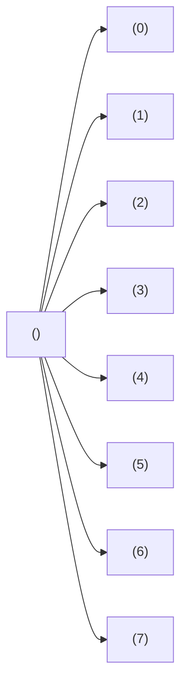

# Backtracking graphe

Version de du [backtracking](../backtracking/backtracking.md) utilisant les graphes.

Se base sur le principe d'une machine à états finis

Transition : placement d'une nouvelle reine

On peut décrire cette stratégie par un graphe dont les sommets sont les différents états du jeu et les arêtes représentent les transitions d'un état à un autre. Dans le cas qui nous intéresse, le graphe ne possède pas de cycle (pas de retour possible), c'est donc un arbre appelé arbre de décision (<https://fr.wikipedia.org/wiki/Arbre_de_d%C3%A9cision>).

Le jeu commence donc avec un échiquier vide et on change d'état à chaque fois qu'une nouvelle reine est placée.

Il y a 8 façons possibles de placer la première reine sur la première colonne. Il s'agit ensuite de déterminer à quelle ligne placer la deuxième reine et ainsi de suite. On peut ainsi représenter une solution par un vecteur (de longueur 8) contenant les numéros de lignes où se trouvent nos huit reines.

Il s'agit d'un parcours dans un graphe implicite (<https://en.wikipedia.org/wiki/Implicit_graph>).

---

Cela signifie que les sommets du graphes sont des vecteurs de 8 2-uples représentant les coordonnées (ligne, colonne) de chaque reine.

Les arrêtes représented l'ajout d'une reine à une ligne et une colonne.

Donc l'arbre a 9 niveaux en comptant le noeud racine, un vecteur vide.

L'objectif est de trouver toutes les solutions.

## Contraintes de validité des numéros de ligne

$\forall l, c \in \N² \cap {[0;8[}^2$ souhaitant être ajouté au vecteur solution $S$,

- Ligne libre : $l \notin S$
- Colonne libre : $c \notin S$
- Diagonal Nord-Est Sud-Ouest : 
