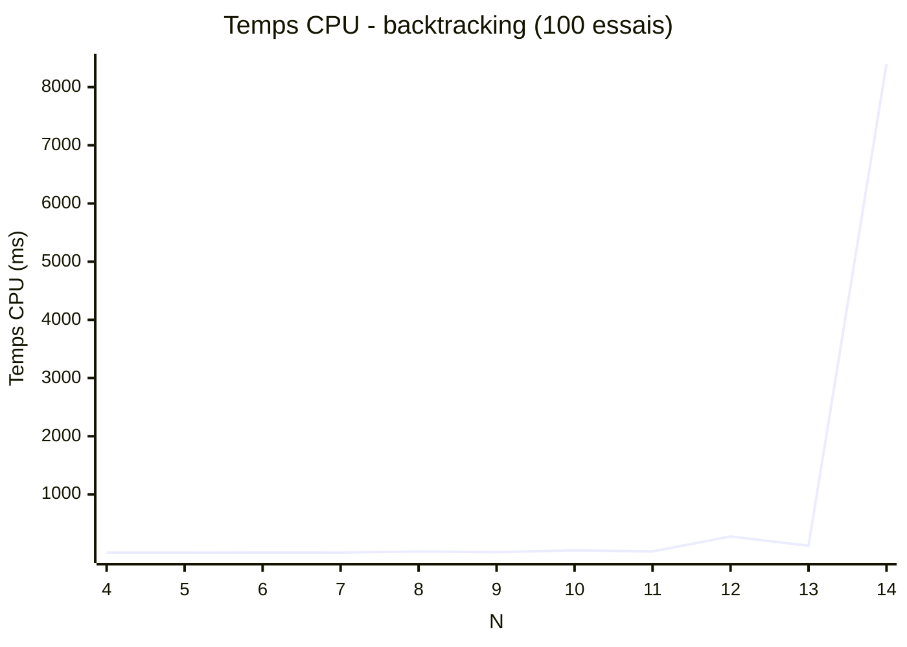
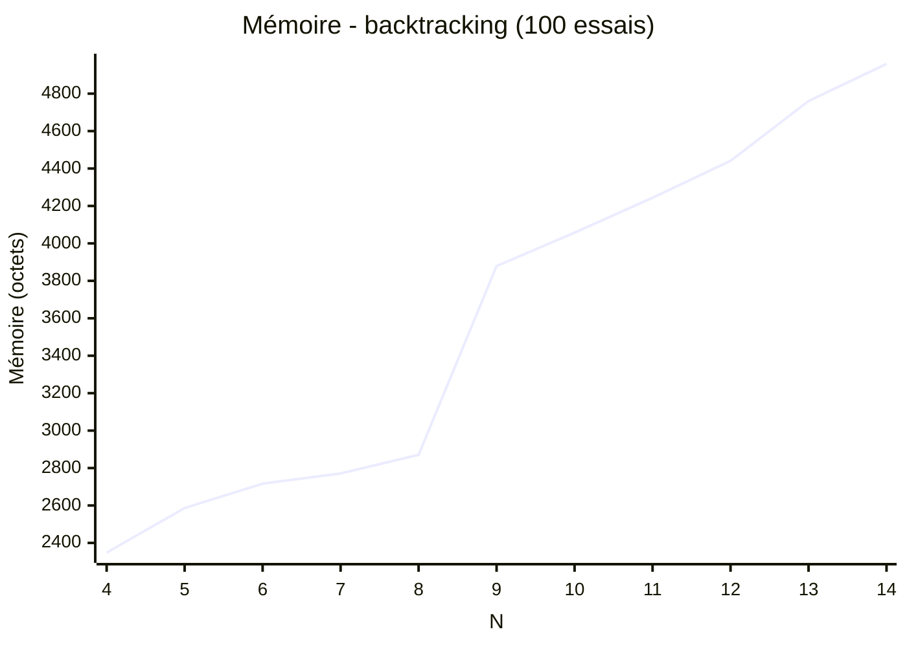

# Algorithme de backtracking

Backtracking simple avec une optimisation : au lieu de parcourir les lignes, colonnes et diagonales sur la grille, on stocke si elle sont libres dans des listes annexes.

Cela permet de réduire le nombre d'accès en mémoire à réaliser pour déterminer si on peut placer une reine.

> Comment identifier les diagonales et trouver les diagonales d'une case ?

On se base sur leur centre.

Et donc l'indice de chaque diagonale de la liste des donné ainsi:

$$
\begin{split}
d_{NE\\\_SO} &= \lfloor\frac{tileNo}{N}\rfloor + N - tileNo \mod N - 1\\
d_{NE\\\_SO} &= row + N - col - 1
\end{split}
$$

$$
\begin{split}
d_{NO\\\_SE} &= \lfloor\frac{tileNo}{N}\rfloor + tileNo \mod N\\
d_{NO\\\_SE} &= row + col
\end{split}
$$

## Benchmark

