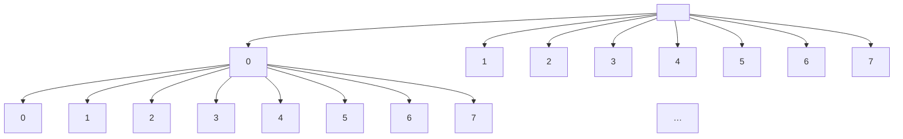
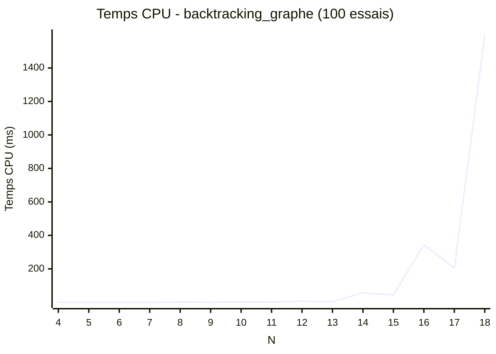
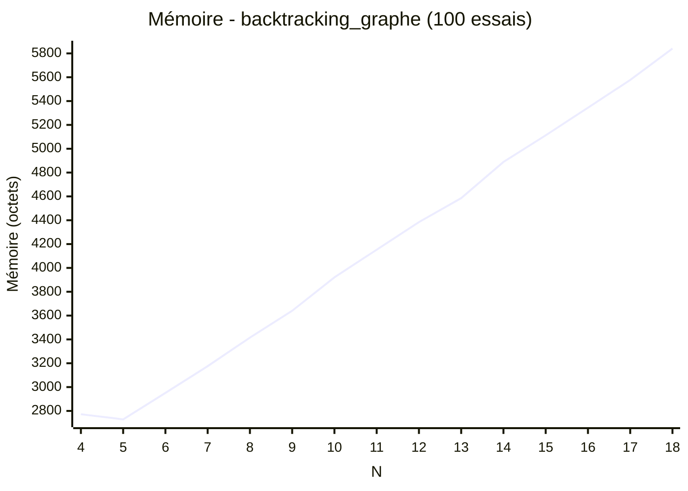

# Algorithme de backtracking graphe

Version de du [backtracking](../backtracking/backtracking.md) utilisant les graphes.

Se base sur le principe d'une machine à états finis.\
Les états sont représentés par des solutions partielles ou complètes.\
Les transitions sont représentées par le placement d'une reine.

On peut décrire cette stratégie par un graphe dont les sommets sont les différents états du jeu et les arêtes représentent les transitions d'un état à un autre. Dans le cas qui nous intéresse, le graphe ne possède pas de cycle (pas de retour possible), c'est donc un arbre appelé arbre de décision (<https://fr.wikipedia.org/wiki/Arbre_de_d%C3%A9cision>).

Le jeu commence donc avec un échiquier vide et on change d'état à chaque fois qu'une nouvelle reine est placée.

Il y a 8 façons possibles de placer la première reine sur la première colonne. Il s'agit ensuite de déterminer à quelle ligne placer la deuxième reine et ainsi de suite. On peut ainsi représenter une solution par un vecteur (de longueur 8) contenant les numéros de lignes où se trouvent nos huit reines.

Il s'agit d'un parcours dans un graphe implicite (<https://en.wikipedia.org/wiki/Implicit_graph>).

---

Cela signifie que les sommets du graphes sont des vecteurs de 8 lignes où placer chaque reine.

Les arrêtes représented l'ajout d'une reine à une ligne et une colonne.

Donc l'arbre a 9 niveaux en comptant le noeud racine, un vecteur vide.

L'objectif est de trouver toutes les solutions.

## Contraintes de validité des numéros de ligne

Entrée :

- `c` : numéro de colonne en cours de traitement
- `S` : le vecteur des lignes
- `g` : la matrice de booléens représentant la grille (vrai si libre)

$\forall r \in \N \cap [0;N[$ souhaitant être ajouté au vecteur solution $S$,

- Ligne libre : $r \notin S$
- Diagonale Nord-Est Sud-Ouest (NE SO) : $g_{i,\ j}$ pour tous $i,\ j$ de $d_{NE\\\_SO}(r, c)$ à $(N, 0)$
- Diagonale Nord-Ouest Sud-Est (NO SE) : $g_{i,\ j}$ pour tous $i,\ j$ de $d_{NO\\\_SE}(r, c)$ à $(N, N)$

### Parcours de diagonales

$$d_{NE\\\_SO}(r, c) \to \begin{split}
a &:= r + c\\
d_c &= min(a, N - 1)\\
d_r &= a - d_c\\
\end{split}$$

Parcours : $d_r+i$, $d_c-j$

$$d_{NO\\\_SE}(r, c) \to \begin{split}
m &:= min(r, c)\\
d_r &= r - m\\
d_c &= c - m
\end{split}$$

Parcours : $d_r+i$, $d_c+j$

## Implémentation du backtracking

Pour implémenter le backtracking, il faut un moyen de faire marche arrière dans la résolution.

On procède colonne par colonne puis ligne par ligne.

On s'aperçoit que toutes les lignes comme toutes les colonnes seront présentes exactement une fois dans la solution.

Disons que si il n'y a pas de ligne valide pour la colonne *c*,
ça veut dire que notre début solution est incorrect et qu'on arrive dans un sans-issue dans l'arbre de décision.

on doit donc faire marche arrière, c'est-à-dire revenir à la colonne précédente et prendre la ligne suivante.

## Benchmark

