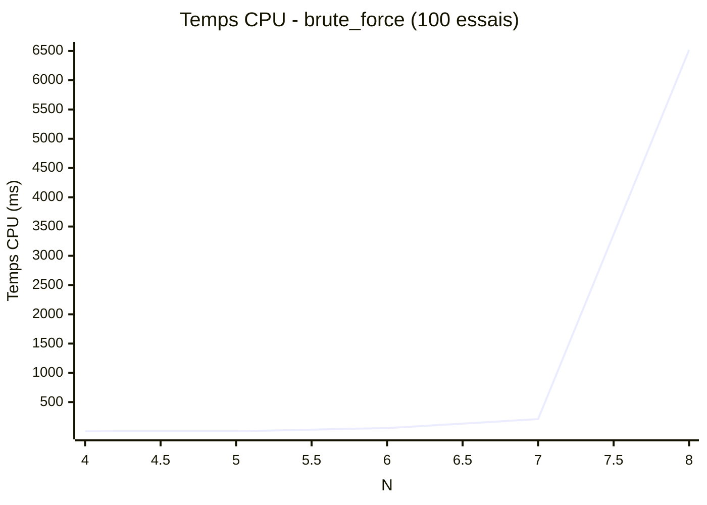
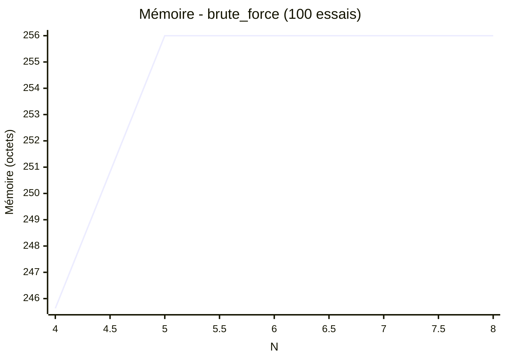

# Algorithme de force brute

## Principe

Le principe du brute force est de tester toutes les possibilités jusqu'à trouver une solution correcte

## Type de résultat attendu

Pour cela, nous utilisons un tableau en une dimension dont chaque valeur peut prendre les valeurs de 0 à n-1.
exemple de solution pour un échiquier de taille 4 :

  [1,3,0,2] et [2,0,3,1]

Les valeurs du tableau représentent l'indice de la ligne de la reine.
Et l'indice de la valeur donne l'indice de la colonne de la reine.

Donc, pour cela, on incrémente de 1 la valeur du premier indice.
Puis dès que la valeur du premier indice atteint la valeur n, la valeur est mise à 0 et l'indice suivant est incrémenté de 1.
Cela renvoie à utiliser un modulo sur chaque valeur du tableau entre chaque valeur.

## Fonction is_valid

L'utilisation d'un tableau en 1 dimension valorise la vérification du tableau.
Il suffit de vérifier si deux points sur une même ligne.

Et de comparer qu'une reine n'est pas dans la diagonale d'une autre.
Pour cela, il suffit de comparer la différence verticale et la différence horizontale entre deux reines.
Si une reine est dans la diagonale d'une autre reine alors les deux résultats seront identiques.

## Référence

Le brute force peut être vu comme l'engrenage de Daniel de Bruin.
C'est un ensemble d'engrenage où le premier engrenage doit faire un tour complet pour que le deuxième avance d'un cran et ainsi de suite.

C'est un engrenage qui vise à représenter le nombre gogol. Car le premier engrenage doit faire un gogol tour pour que le dernier engrenage fasse un tour.
Soit un temps supérieur que l'âge de l'univers.

## Benchmark

