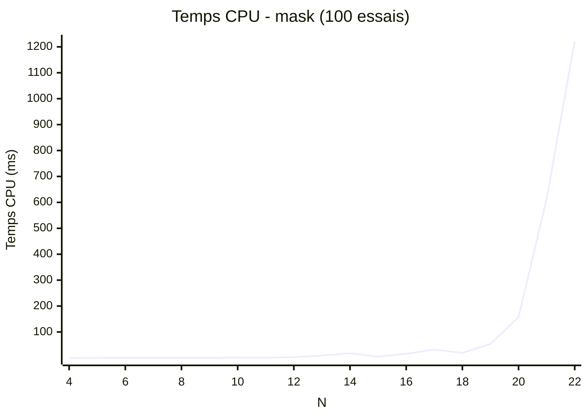
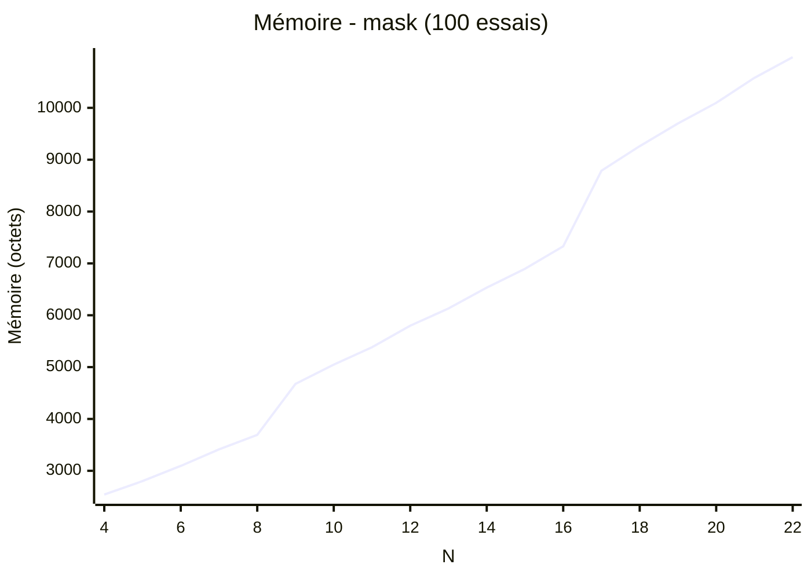

# Algorithme du masque

Idée initiale&nbsp;: au lieu d'utiliser des booléens pour indiquer si une cellule contient ou non une reine, on indique si une case est menacée ou non.

Donc quand on place un reine on met à faux la cellule de la reine, sa ligne et sa colonne, ainsi que ses deux diagonales.

Donc maintenant tout ce qu'il reste à faire c'est itérer sur les N premières cellules vraies.

On pourrait dire qu'on "masque" les cellules menacées lors de la résolution.

C'est une version optimisée du backtracking.

## Problème

Si le placement d'une reine menace une cellule, puis un second placement menace cette même cellule, alors quand une des deux reines est enlevée dans le backtracking, la cellule redeviendra sûre et on perdra l'information.

La solution est simplement d'utiliser des entiers à la place des booléens, c'est-à-dire que chaque cellule conserve le nombre de reines qui la menacent (0 au départ).

## Optimisation

Devrions-nous toujours commencer le backtracking à *0,0* (en haut à gauche). Il y a peut-être d'autres possibilités :

On pourrait commencer par le milieu et progresser vers l'extérieur en spirales dans le sens des aiguilles d'une montre.

Résultat : l'ordre des colonnes tangue de *n//2* vers *0* et *n-1*.

## Benchmark

