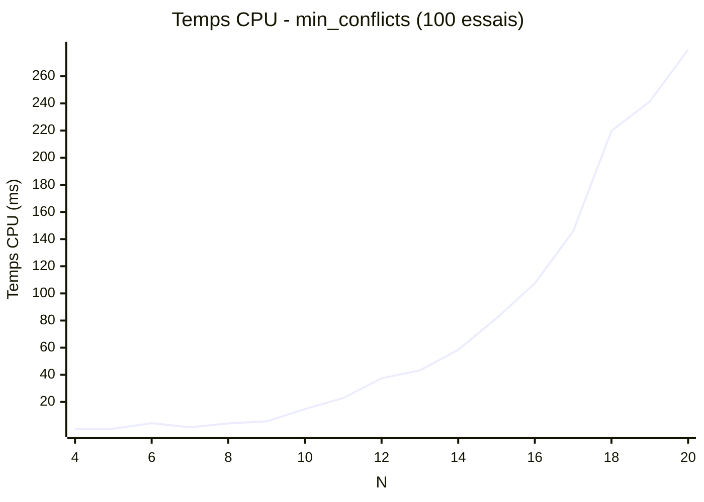
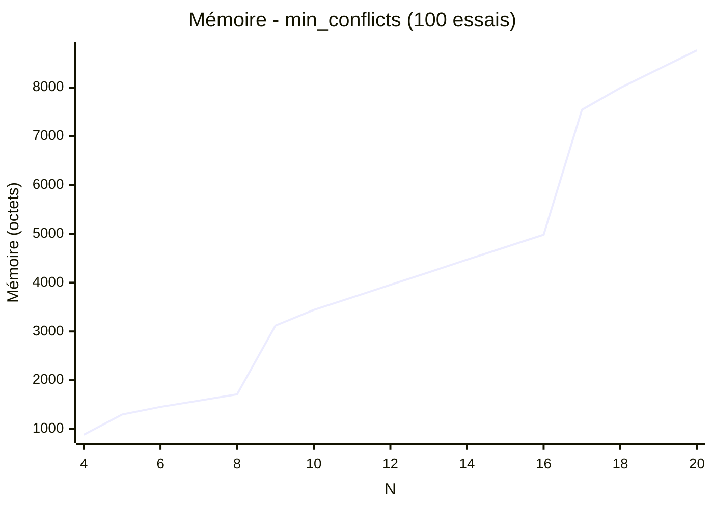

# Algorithme des conflits minimum

## Principe

Le principe de cet algorithme repose sur une notation des cases en danger et le choix aléatoire de placement de reine, c'est un algorithme glouton.

## Explications

L'algorithme de min conflits consite a placer une première reine, de manière aléatoire, sur la première colonne d'un échiquier vide, et on note toutes les cases mises en danger par cette reine.
Puis quand on place la deuxieme reine dans la deuxième colonne on prend on compte les cases mises en danger et on place cette nouvelle reine dans une des cases mise le moins en danger, puis on note encoretoutes les cases mises en danger en augmantant la sévérité du danger des cases déja en danger. On continue cette approche jusqu'à que toutes les reines soient placées.

Le fonctionnement de cette algorithme repose sur l'aléatoire du placement des reines pour éviter les blockages. Cela fait que chaque solution est quasi-unique et donc non-déterministe.

## Benchmark

