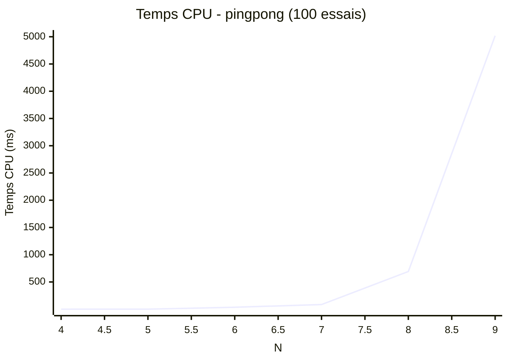
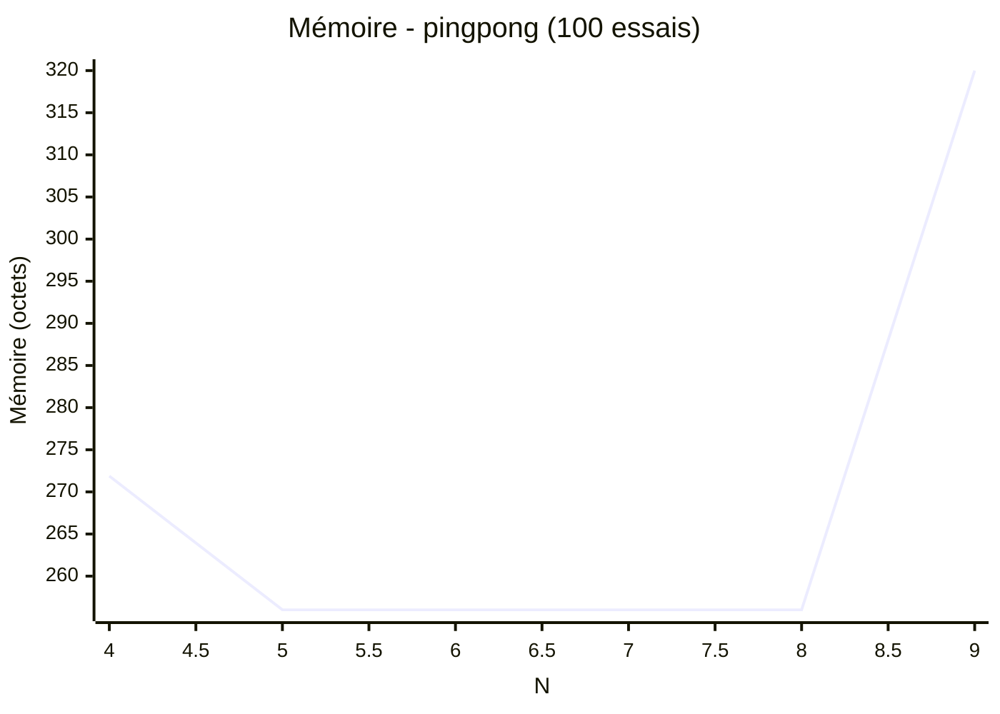

# Algorithme du ping-pong

(comme force brute mais avec de l'aléatoire)

Incrémente de 1 chaque indice du tableau de résultat

Quand le premier élément arrive à la limite n.
On réalise un modulo de n et incrémente de 1 au second élément et ainsi de suite.

La  différence avec l'algorithme fore brute c'est qu'ici on choisit la colonne à incrémenter aléatoirement

## Fonction is_valid

L'utilisation d'un tableau en 1 dimension valorise la vérification du tableau.
Il suffit de vérifier si deux points sur une même ligne.

Et de comparer qu'une reine n'est pas dans la diagonale d'une autre.
Pour cela, il suffit de comparer la différence verticale et la différence horizontale entre deux reines.
Si une reine est dans la diagonale d'une autre reine alors les deux résultats seront identiques.

## Benchmark

