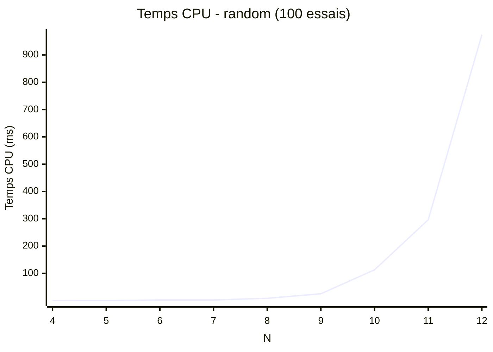
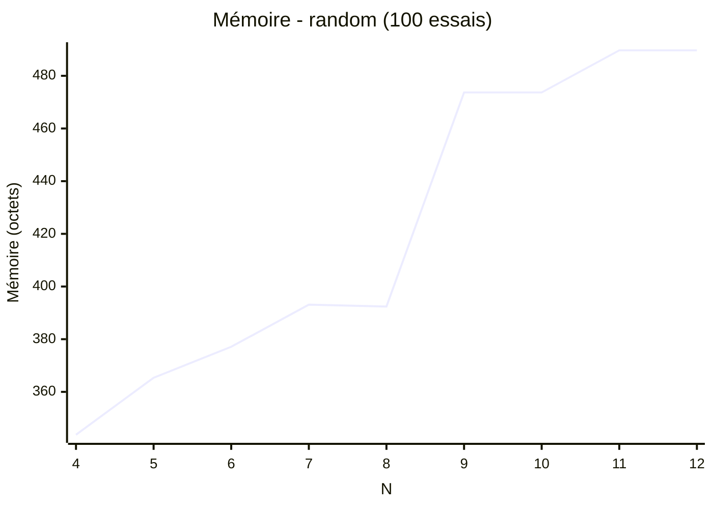

# Algorithme aléatoire

## Principe

Le principe de la technique aléatoire est de générer aléatoirement un tableau de taille n en 1 dimension.

## Fonctionnement

Pour cela, nous utilisons un tableau en une dimension dont chaque valeur peut prendre les valeurs de 0 à n-1.
exemple de solution pour un échiquier de taille 4 :

  [1,3,0,2] et [2,0,3,1]

Les valeurs du tableau représentent l'indice de la ligne de la reine.
Et l'indice de la valeur donne l'indice de la colonne de la reine.

On choisi aléatoirement le numéro de ligne du placement pour chaque colonne.
La valeur est choisie entre 0 et n-1 et ne peut pas être représenté deux fois dans la liste.

Pour cela, on créer un tableau avec les valeurs de 0 à n-1.
Puis on extrait les valeurs suivant un indice choisi aléatoirement.
La fonction essaye de résoudre le problème tant qu'elle n'a pas trouvé de résolution correcte.

Les temps varient beaucoup entre chaque taille différente.
La recherche peut être instantanée, mais peut également être exponentielle suivant la taille de l'échiquier.

## Fonction is_valid

L'utilisation d'un tableau en 1 dimension valorise la vérification du tableau.
Il suffit de vérifier si deux points sur une même ligne.

Et de comparer qu'une reine n'est pas dans la diagonale d'une autre.
Pour cela, il suffit de comparer la différence verticale et la différence horizontale entre deux reines.
Si une reine est dans la diagonale d'une autre reine alors les deux résultats seront identiques.

## Benchmark

