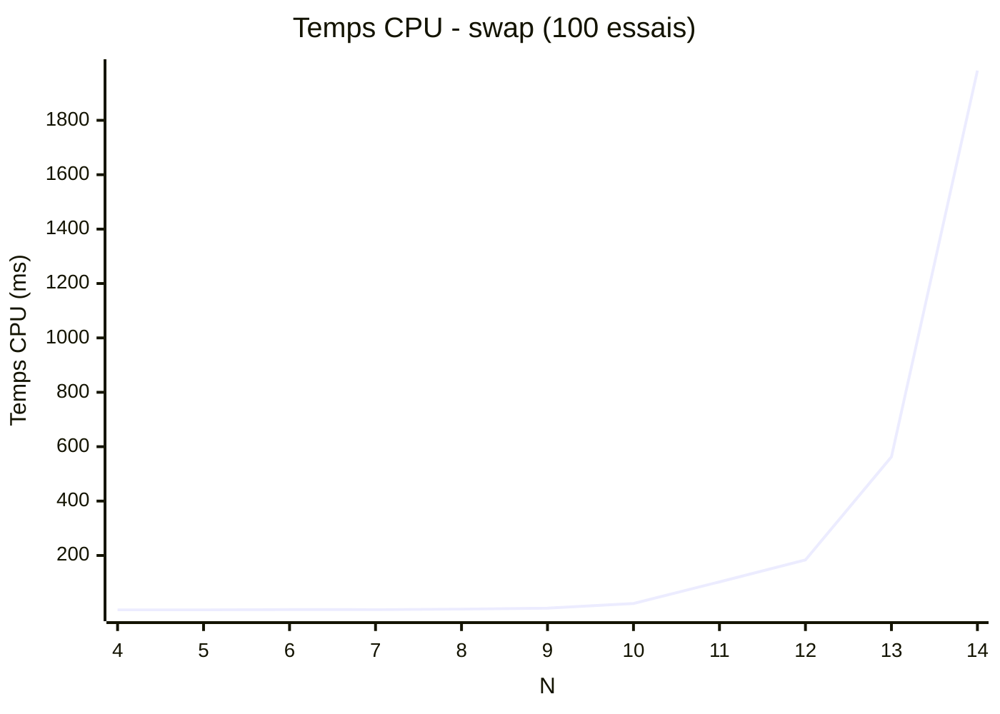
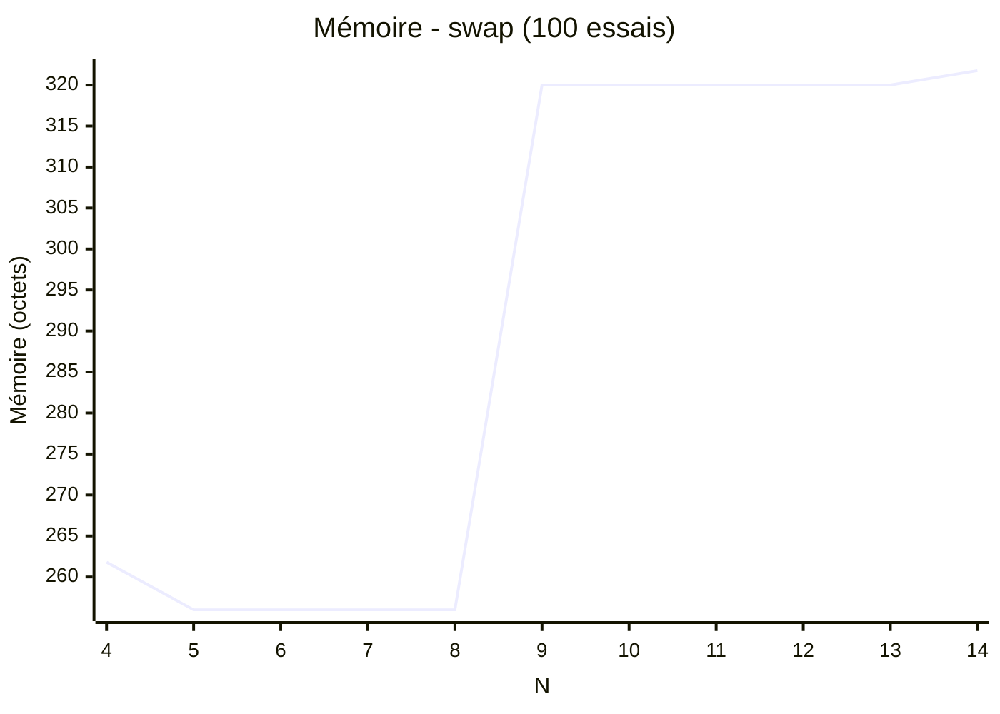

# Algoritmhe d'échange

## Principe

Le principe du swap est de prendre un indice aléatoire du tableau de résultat et de l'échanger avec l'indice supérieur.

## Fonctionnement

Pour cela, nous utilisons un tableau en une dimension dont chaque valeur peut prendre les valeurs de 0 à n-1.
exemple de solution pour un échiquier de taille 4 :

  [1,3,0,2] et [2,0,3,1]

Les valeurs du tableau représentent l'indice de la ligne de la reine.
Et l'indice de la valeur donne l'indice de la colonne de la reine.

Nous commençons par générer un tableau de taille n avec les valeurs de 0 à n-1.
On prend un indice aléatoire du tableau puis on l'échange avec l'indice supérieur.
On établi le processus jusqu'à obtenir un résultat correct.

Au niveau des temps d'exécution, la fonction n'est pas très rapide.

## Fonction is_valid

L'utilisation d'un tableau en 1 dimension valorise la vérification du tableau.
Il suffit de vérifier si deux points sur une même ligne.

Et de comparer qu'une reine n'est pas dans la diagonale d'une autre.
Pour cela, il suffit de comparer la différence verticale et la différence horizontale entre deux reines.
Si une reine est dans la diagonale d'une autre reine alors les deux résultats seront identiques.

## Benchmark

