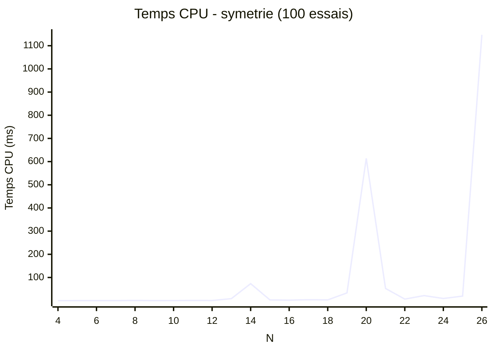
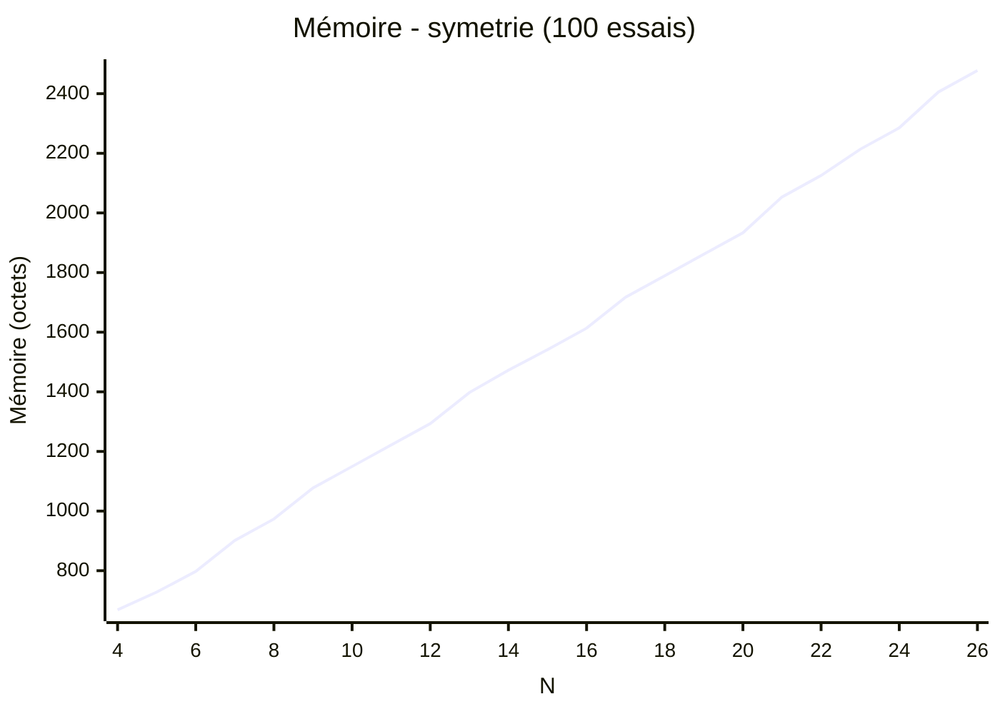

# Algorithme de symétrie

L'algorithme symétrie est un algorithme back-tracking cependant Les reines sont posées 2 par deux symétriquement.
Il est rapide et demande peu de mémoire cependant dans certains cas il va prendre beaucoup de temps comme quand l'échiquier à un côté de 32 cases.

## Fonction is_valid_clg

La fonction is_valid_clg utilise une liste de coordonnées sous forme de liste à 2 dimensions pour la vérification
Il suffit de vérifier si deux points sur une même ligne.

Et de comparer qu'une reine n'est pas dans la diagonale d'une autre.
Pour cela, il suffit de comparer la différence verticale et la différence horizontale entre deux reines.
Si une reine est dans la diagonale d'une autre reine alors les deux résultats seront identiques.

## Benchmark

